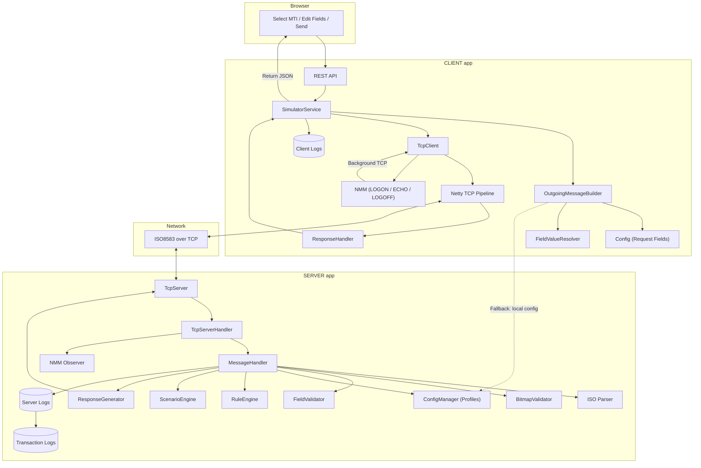
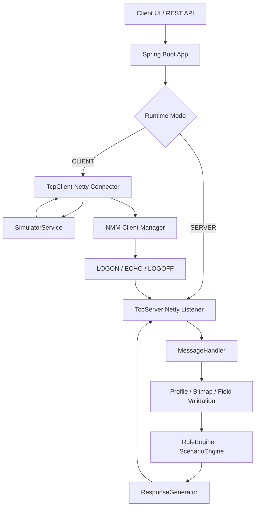
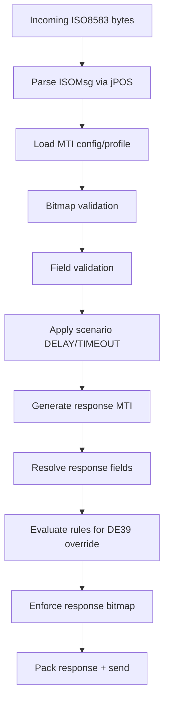
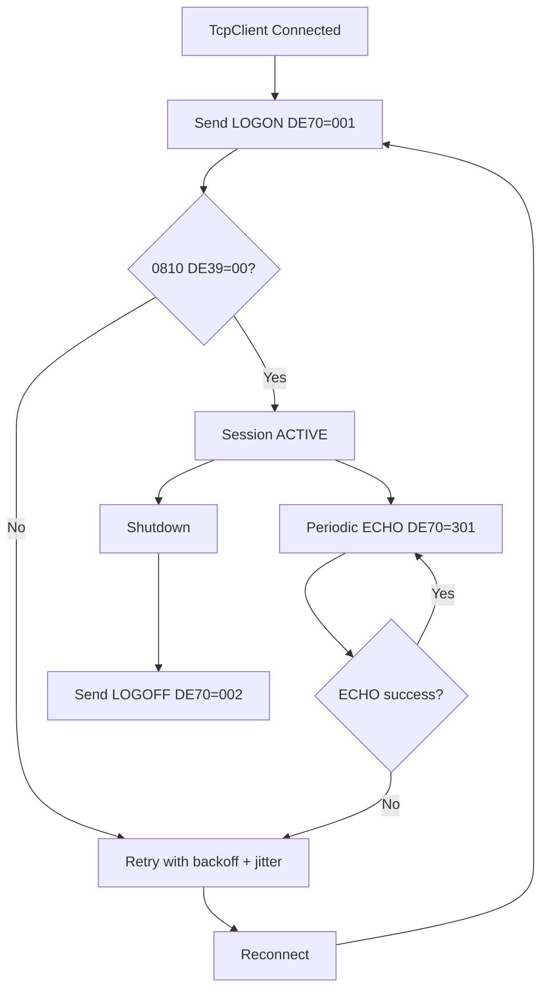

<div align="center">

# ISO8583 PG Simulator

<!-- Project Logo / Hero Image -->
<!-- Replace this placeholder with your hosted logo/banner URL -->


<br/>


</div>

---

## Screenshots 

> Add your UI screenshots and demo GIFs here.  
> You can upload images to GitHub issues/PR comments and paste the generated URLs, or keep assets in a local `assets/` folder.

### Dashboard Preview


### MTI / Bitmap Configuration


### Rule Engine / Scenario Demo


### End-to-End Flow


---

## What This Project Does

This project is a practical ISO 8583 payment gateway simulator designed for integration testing, UAT, and protocol validation.

It lets you:
- Run an ISO TCP **SERVER** instance to receive and respond to messages.
- Run a **CLIENT** instance that sends transactions to the server.
- Configure behavior per MTI using request/response bitmaps, field rules, and scenarios.
- Simulate network-management lifecycle with NMM (`0800/0810`, DE70 logon/echo/logoff).
- Test real payment flows like `0100->0110`, `0200->0210`, `0400->0410`, etc.

---

## Core Capabilities

- Dual runtime roles: `SERVER` and `CLIENT`
- Profile-driven MTI configuration (request + response contract)
- Bitmap validation and field validation
- Dynamic response field resolution (`DATETIME`, `TIME`, `RRN`, pass-through fields)
- Rule engine for response code override (e.g., DE39 declines)
- Scenario engine (`NONE`, `DELAY`, `TIMEOUT`)
- In-memory transaction and message logging with REST access
- Docker + Docker Compose setup for fast environment bootstrapping

---

## System Architecture



---

## Transaction Processing Flow



---

## NMM Lifecycle Flow (CLIENT mode)



---

## Project Structure

```text
pgsim_ISO8583-mainV3/
├── Dockerfile
├── docker.compose.yml
├── pom.xml
├── src/
│   ├── main/java/com/payu/pgsim/
│   │   ├── controller/        # REST endpoints
│   │   ├── tcp/               # Netty TCP client/server
│   │   ├── handler/           # Message processing orchestration
│   │   ├── validator/         # Bitmap/field/profile/config validators
│   │   ├── generator/         # Response generation
│   │   ├── engine/            # Rule + scenario engines
│   │   ├── nmm/               # NMM lifecycle manager
│   │   ├── store/             # In-memory stores
│   │   └── service/           # Simulator/profile/runtime services
│   └── main/resources/
│       ├── application.properties
│       ├── message-config.json
│       ├── iso87ascii.xml
│       ├── iso87binary.xml
│       └── static/            # Frontend dashboard
└── README.md
```

---

## Setup Guide

### Prerequisites

- Docker Desktop / Docker Engine
- (Optional local run) Java 17+

---

### Method 1: Docker Compose (Recommended)

1) Clone repository

```bash
git clone https://github.com/ak8057/ISO8583_PGSim_PAYU_Worklet.git
cd ISO8583_PGSim_PAYU_Worklet
```

2) Start both instances

```bash
docker compose -f docker.compose.yml up --build -d
```

3) Verify health

```bash
curl -s http://127.0.0.1:8081/actuator/health
curl -s http://127.0.0.1:8082/actuator/health
```

4) Open UI
- Server UI: `http://127.0.0.1:8081/index.html`
- Client UI: `http://127.0.0.1:8082/index.html`

5) Stop

```bash
docker compose -f docker.compose.yml down
```

---

### Method 2: Dockerfile (Manual Containers)

1) Build image

```bash
docker build -t pgsim:latest .
```

2) Create network

```bash
docker network create pgsim-net
```

3) Run SERVER

```bash
docker run -d --name pgsim-server \
  --network pgsim-net \
  -p 8081:8081 -p 8080:8080 \
  -e APP_ARGS="--server.port=8081 --simulator.mode=SERVER --simulator.instance.role=SERVER --simulator.mode.switch-enabled=false --simulator.tcp.port=8080" \
  pgsim:latest
```

4) Run CLIENT

```bash
docker run -d --name pgsim-client \
  --network pgsim-net \
  -p 8082:8082 \
  -e APP_ARGS="--server.port=8082 --simulator.mode=CLIENT --simulator.instance.role=CLIENT --simulator.mode.switch-enabled=false --simulator.client.host=pgsim-server --simulator.client.port=8080 --simulator.remote.server.host=pgsim-server --simulator.remote.server.port=8081 --pgsim.nmm.enabled=true --pgsim.nmm.echo-interval-ms=60000 --pgsim.nmm.retry-count=5 --pgsim.nmm.retry-delay-ms=10000 --pgsim.nmm.auto-reconnect=true --pgsim.nmm.response-timeout-ms=10000" \
  pgsim:latest
```

5) Cleanup

```bash
docker rm -f pgsim-client pgsim-server
docker network rm pgsim-net
```

---

### Method 3: Local Maven Run

Run SERVER:

```bash
./mvnw spring-boot:run -Dspring-boot.run.arguments="--server.port=8081 --simulator.mode=SERVER --simulator.instance.role=SERVER --simulator.mode.switch-enabled=false --simulator.tcp.port=8080"
```

Run CLIENT in second terminal:

```bash
./mvnw spring-boot:run -Dspring-boot.run.arguments="--server.port=8082 --simulator.mode=CLIENT --simulator.instance.role=CLIENT --simulator.mode.switch-enabled=false --simulator.client.host=127.0.0.1 --simulator.client.port=8080 --simulator.remote.server.host=127.0.0.1 --simulator.remote.server.port=8081 --pgsim.nmm.enabled=true --pgsim.nmm.echo-interval-ms=60000 --pgsim.nmm.retry-count=5 --pgsim.nmm.retry-delay-ms=10000 --pgsim.nmm.auto-reconnect=true --pgsim.nmm.response-timeout-ms=10000"
```

---

## API Examples

### Send a transaction through CLIENT instance

```bash
curl -sS -X POST http://127.0.0.1:8082/api/simulator/send \
  -H "Content-Type: application/json" \
  -d '{"mti":"0100","fields":{"2":"5123456789012345","3":"000000","4":"000000001000","11":"123456"}}'
```

Expected:
- MTI `0110`
- DE39 `00` (unless declined by configured rules)

### Health checks

```bash
curl -s http://127.0.0.1:8081/actuator/health
curl -s http://127.0.0.1:8082/actuator/health
```

---

## Testing Checklist (Quick)

- `0100 -> 0110`
- `0200 -> 0210`
- `0400 -> 0410`
- `0800 -> 0810`
- Missing mandatory field -> validation error
- Rule decline path (e.g., high amount -> DE39 != 00)
- NMM connect + reconnect behavior

---

## Troubleshooting

- Port conflict:
  - stop existing process on `8080/8081/8082`
- Containers running but UI not updating:
  - use profile page `Refresh`/`Sync` and hard refresh browser once after deployment change
- Client not reaching server:
  - check `simulator.client.host` / `simulator.client.port`
- Health endpoint down:
  - check logs: `docker logs pgsim-server` / `docker logs pgsim-client`

---

## Tech Stack

| Layer | Technology |
|------|------------|
| Backend | Spring Boot, Java 17 |
| Networking | Netty |
| ISO Parser | jPOS |
| Build | Maven Wrapper |
| Observability | Spring Actuator, Prometheus endpoint |
| Deployment | Docker, Docker Compose |
| UI | Static HTML/CSS/JS served by Spring |

---

## Status

This project is integration/UAT ready and actively structured for production hardening (auth, persistence versioning, deeper observability, CI load/soak pipelines).
